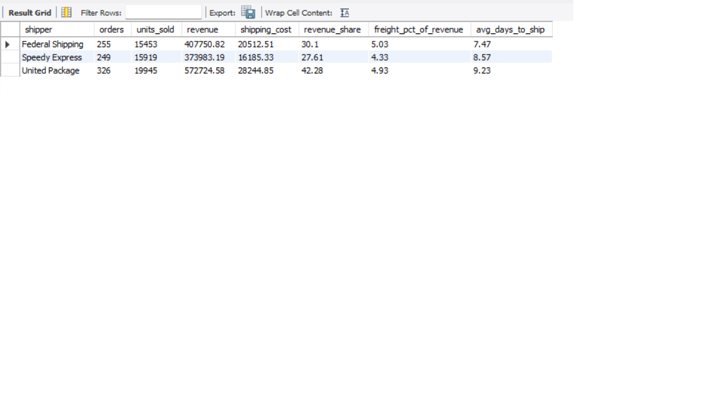
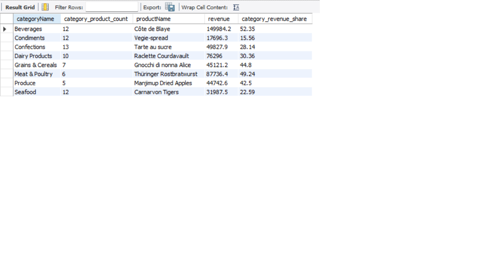

# Northwind SQL Business Analysis

## 1. Project Overview

This project uses SQL to analyze the Northwind database from a business perspective.

The analysis explores sales performance, product and category performance, customer behavior, employee performance, and shipping operations.

## 2. Business Questions

This analysis aims to answer the following business questions:

1. How is revenue evolving over time?

2. Which products generate the most revenue, and how concentrated is revenue among the top products?

3. Which products drive revenue across different time periods?

4. Which categories generate the most revenue?

5. Which customers generate the most revenue, and which customers show the highest level of repeat purchasing?

6. Which employees generate the most revenue and sales volume?

7. How does shipping performance differ between shipping companies?

8. Which product generates the most revenue within each category?

## 3. Dataset

### Source

The analysis is based on the Northwind database.

[Northwind dataset](https://mavenanalytics.io/data-playground/northwind-traders?utm_source=chatgpt.com)

### Database Structure

The analysis uses the following tables:

- `raw_customers` — Customer information
- `raw_orders` — Order information
- `raw_order_details` — Products, quantities and prices for each order
- `raw_products` — Product information
- `raw_categories` — Product categories
- `raw_employees` — Employee information
- `raw_shippers` — Shipping company information

### Table Relationships

## Main Table Relationships

The dataset is structured around orders, which connect customers, employees, and shippers. Order details link each order to the products purchased, while products are grouped into categories.

- `raw_employees` → `raw_orders`: `employeeID`
- `raw_customers` → `raw_orders`: `customerID`
- `raw_shippers` → `raw_orders`: `shipperID`
- `raw_orders` → `raw_order_details`: `orderID`
- `raw_products` → `raw_order_details`: `productID`
- `raw_categories` → `raw_products`: `categoryID`

## 4. Data Validation & Data Quality

Before performing the analysis, the dataset was validated to ensure data consistency, completeness, and referential integrity.

The validation process included:

- **Table and record counts** — verifying that all expected tables contain data and checking the number of records in each table.
- **Duplicate records** — identifying potential duplicate records in tables where unique identifiers are expected.
- **NULL values** — checking for missing values in key fields and identifying columns that may affect the analysis.
- **Referential integrity** — verifying that foreign key relationships between tables are consistent and that there are no orphan records.
- **Data consistency** — checking that values follow the expected format and logical constraints of the dataset.

These checks help ensure that the subsequent analysis is based on reliable and consistent data.

### Unique Identifier in `raw_order_details`

During the validation process, it was identified that `raw_order_details` does not contain a single column that uniquely identifies each record.

`orderID` is not unique because a single order can contain multiple products, while `productID` is not unique because the same product can appear in multiple orders.

To uniquely identify each order detail record, the combination of:

`orderID + productID`

## 5. Analysis

### 5.1 Revenue Analysis

- Revenue shows a strong overall upward trend over the analyzed period, despite significant month-to-month fluctuations.
- Monthly revenue is highly volatile, with several periods showing substantial increases and decreases.
- In 2014, particularly high revenue was observed in January, October, and December, with December showing a strong 68.75% increase compared with the previous month.
- Revenue continued to grow strongly at the beginning of 2015, reaching a peak of 134.6K in April.

### 5.2 Product Performance

- With 57 products in the dataset, an equal distribution of revenue would result in approximately **1.75% per product**.
- Revenue is highly concentrated among a small number of products. **Côte de Blaye** is the strongest-performing product, generating **11.07%** of total revenue, followed by **Thüringer Rostbratwurst (6.48%)** and **Raclette Courdavault (5.63%)**.
- The **top 3 products account for 23.18% of total revenue**, showing a significant concentration of revenue among the best-performing products.
- After the top three products, revenue becomes considerably more distributed, with most products contributing between approximately **0.1% and 4%** of total revenue.

- The leading product varies considerably across months, indicating that revenue performance is not consistently driven by a single product.
- Several products repeatedly appear as monthly revenue leaders, particularly **Côte de Blaye**, **Raclette Courdavault**, and **Thüringer Rostbratwurst**.
- **Côte de Blaye** appears particularly frequently as the top-performing product around the end and beginning of the year. Its repeated strong performance during these periods may indicate a **potential seasonal pattern** that would require further analysis to confirm.
- The revenue share of the monthly top-performing product also varies significantly, ranging from approximately **7.8% to 33.9%**, showing that the degree of revenue concentration changes considerably between months.

### 5.3 Category Performance

- Revenue is relatively well distributed across product categories. Beverages and Dairy Products are the two largest contributors, accounting for 21.15% and 18.56% of total revenue respectively, while the remaining categories each contribute between approximately 7% and 13%.

### 5.4 Customer Analysis

- Revenue shows a clear concentration among the top customers. **QUICK, SAVEA, and ERNSH** are the three largest customers, generating **8.67%, 8.54%, and 8.36%** of total revenue respectively.
- These three customers collectively account for **25.57% of total revenue**, meaning that approximately one quarter of revenue comes from just three customers.
- There is a significant drop after the top three customers, with the fourth-largest customer contributing 4.23% and the fifth 3.86%.
- Beyond the largest customers, revenue is distributed much more gradually across the customer base, with a long tail of customers contributing relatively small shares individually.

### 5.5 Employee Performance

- Revenue is relatively well distributed across employees, with no single employee accounting for a disproportionate share of total revenue.
- **Margaret Peacock** generates the highest total revenue, contributing **18.47%** of the total.
- However, revenue does not directly correlate with order volume. **Robert King**, for example, generates the highest average revenue per order at approximately **1.962**, despite handling fewer orders than the top sales-volume employees.
- This suggests that employee performance differs not only in sales volume, but also in the average value of the orders handled.

### 5.6 Shipping Performance

- Revenue is relatively well distributed across the three shipping companies. **United Package** generates the largest share at **42.28%**, followed by **Federal Shipping** at **30.10%** and **Speedy Express** at **27.61%**.
- Shipping time varies across carriers. **Federal Shipping** has the shortest average shipping time at **7.47 days**, compared with **8.57 days** for Speedy Express and **9.23 days** for United Package.
- Despite being the fastest carrier, Federal Shipping has the highest freight-to-average ratio at **5.03%**, while United Package has the lowest at **4.93%**.
### 5.7 Best Product per Category

- Several categories show a strong concentration of revenue around a single product.
- **Côte de Blaye** is the clearest example, generating **52.35%** of the total revenue within the Beverages category.
- **Thüringer Rostbratwurst** and **Gnocchi di nonna Alice** also account for nearly half of their respective categories, with **49.24%** and **44.80%** of category revenue.
- Other leading products such as **Manjimup Dried Apples** (42.50%) and **Raclette Courdavault** (30.36%) also represent a substantial share of their categories.
- This suggests that some categories are highly dependent on a small number of products, while others have a more diversified revenue distribution.

## 6. Tools & Technologies

- **MySQL** — Data cleaning, validation and analysis
- **SQL** — Data transformation, aggregation and analytical queries
- **Git & GitHub** — Version control and project documentation

