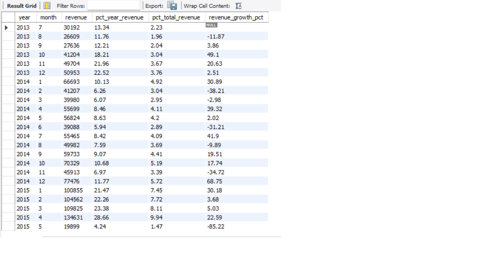
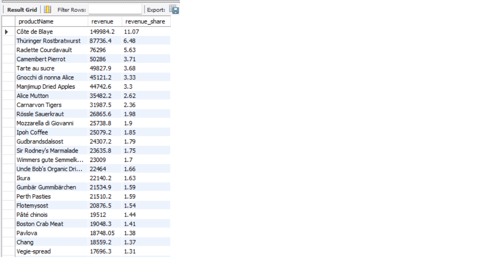
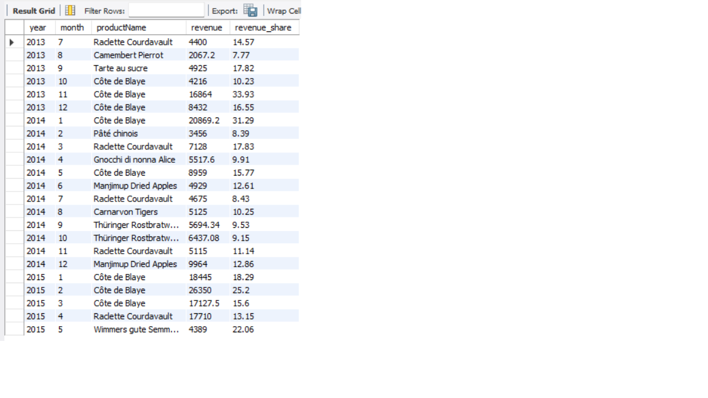
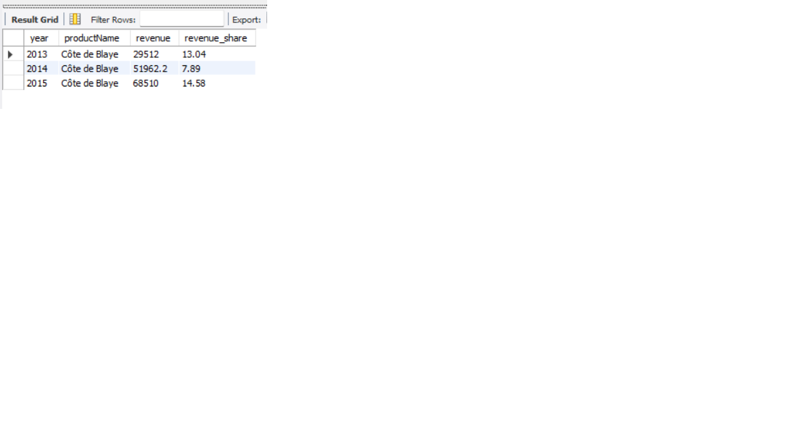
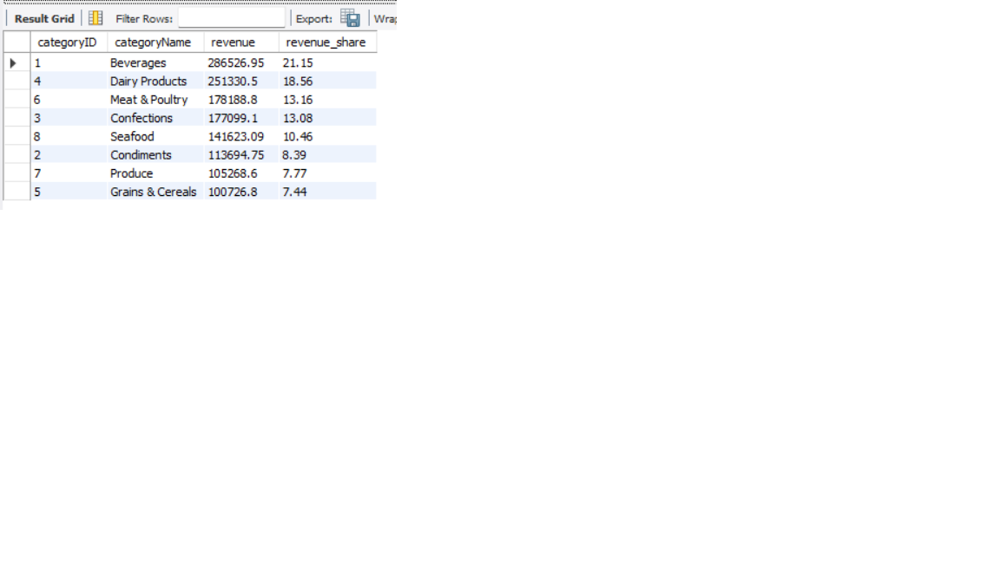
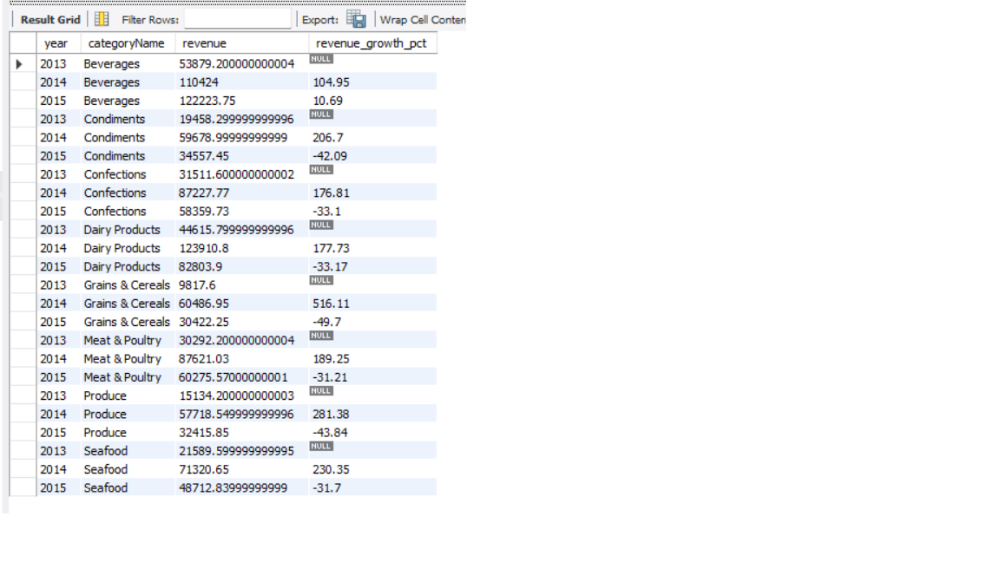
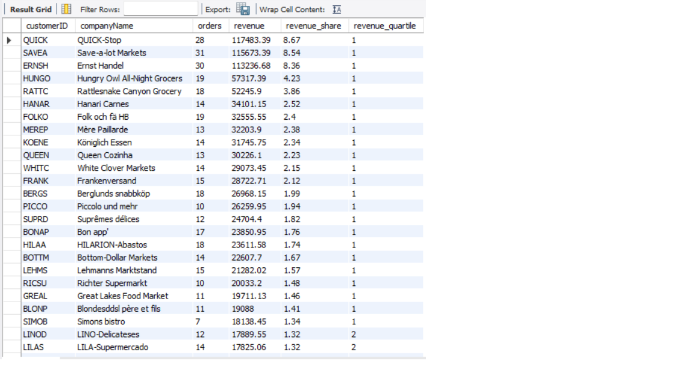
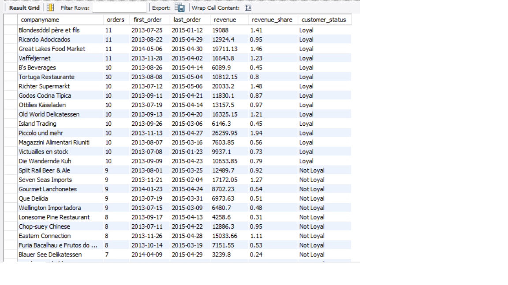
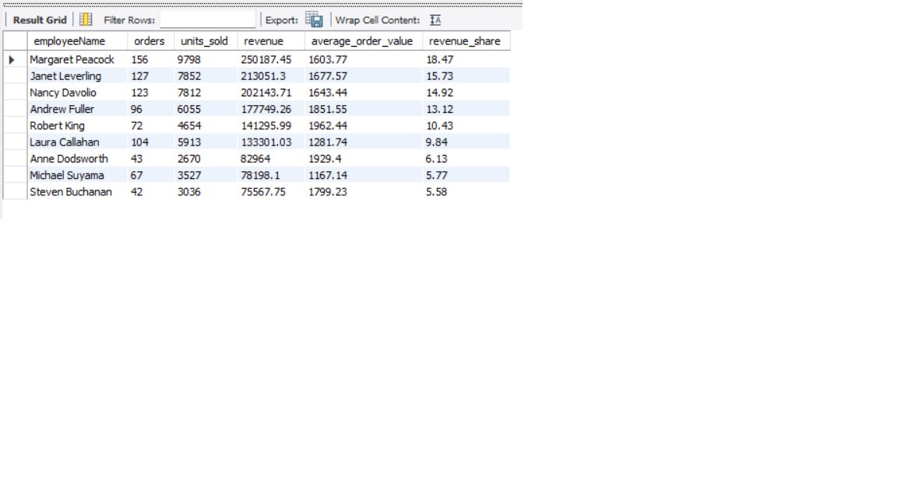

# Northwind SQL Business Analysis

## 1. Project Overview

This project uses SQL to analyze the Northwind database from a business perspective.

The analysis explores sales performance, product and category performance, customer behavior, employee performance, and shipping operations.

## 2. Business Questions

This analysis aims to answer the following business questions:

1. How is revenue evolving over time?

2. Which products generate the most revenue, and how concentrated is revenue among the top products?

3. Which products drive revenue across different time periods?

4. Which categories generate the most revenue, and how does their performance evolve over time?

5. Which customers generate the most revenue, and which customers show the highest level of repeat purchasing?

6. Which employees generate the most revenue and sales volume?

7. How does shipping performance differ between shipping companies?

8. Which product generates the most revenue within each category?

## 3. Dataset

### Source

The analysis is based on the Northwind database.

[Northwind dataset](https://mavenanalytics.io/data-playground/northwind-traders?utm_source=chatgpt.com)

### Database Structure

The analysis uses the following tables:

- `raw_customers` — Customer information
- `raw_orders` — Order information
- `raw_order_details` — Products, quantities and prices for each order
- `raw_products` — Product information
- `raw_categories` — Product categories
- `raw_employees` — Employee information
- `raw_shippers` — Shipping company information

### Table Relationships

## Main Table Relationships

The dataset is structured around orders, which connect customers, employees, and shippers. Order details link each order to the products purchased, while products are grouped into categories.

- `raw_employees` → `raw_orders`: `employeeID`
- `raw_customers` → `raw_orders`: `customerID`
- `raw_shippers` → `raw_orders`: `shipperID`
- `raw_orders` → `raw_order_details`: `orderID`
- `raw_products` → `raw_order_details`: `productID`
- `raw_categories` → `raw_products`: `categoryID`

## 4. Data Validation & Data Quality

Before performing the analysis, the dataset was validated to ensure data consistency, completeness, and referential integrity.

The validation process included:

- **Table and record counts** — verifying that all expected tables contain data and checking the number of records in each table.
- **Duplicate records** — identifying potential duplicate records in tables where unique identifiers are expected.
- **NULL values** — checking for missing values in key fields and identifying columns that may affect the analysis.
- **Referential integrity** — verifying that foreign key relationships between tables are consistent and that there are no orphan records.
- **Data consistency** — checking that values follow the expected format and logical constraints of the dataset.

These checks help ensure that the subsequent analysis is based on reliable and consistent data.

### Unique Identifier in `raw_order_details`

During the validation process, it was identified that `raw_order_details` does not contain a single column that uniquely identifies each record.

`orderID` is not unique because a single order can contain multiple products, while `productID` is not unique because the same product can appear in multiple orders.

To uniquely identify each order detail record, the combination of:

`orderID + productID`

## 5. Analysis

### 5.1 Revenue Analysis

### 5.2 Product Performance

### 5.3 Category Performance

### 5.4 Customer Analysis

### 5.5 Employee Performance

### 5.6 Shipping Performance

### 5.7 Best Product per Category

## 6. Key Findings

## 7. Tools & Technologies

## 8. Project Structure

## 9. How to Run

## 10. Conclusions
